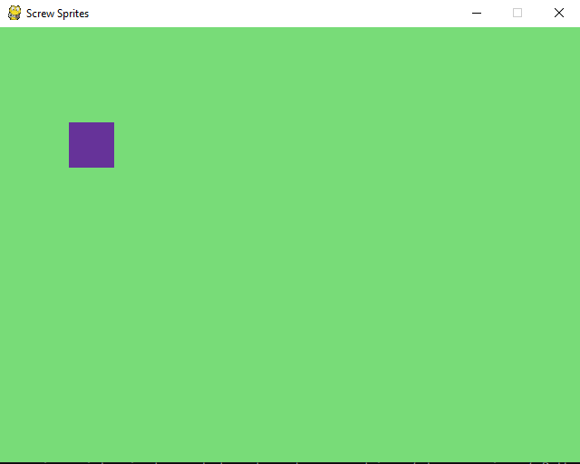
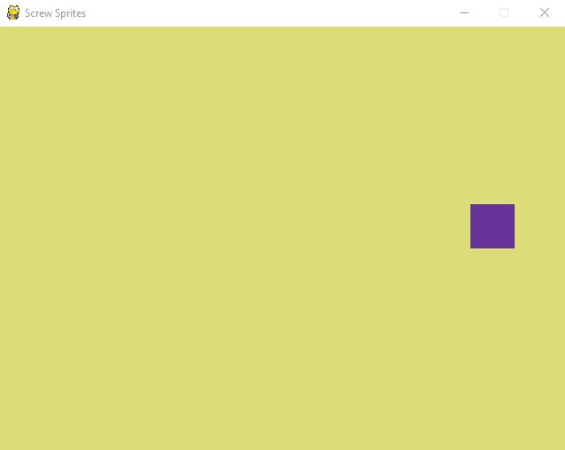
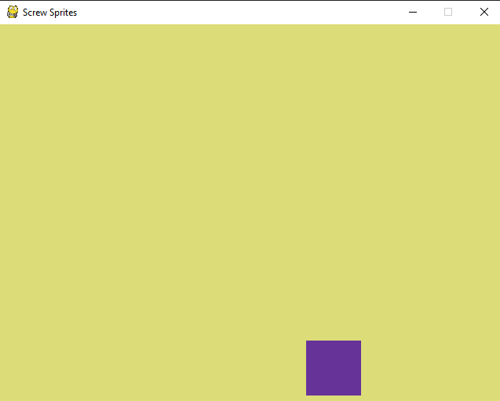

# Movable sprite that doesn't leave the screen(Assignment 5.1)
Travis Bales

## Description:
Using command line parameters set the screen size, title, color of the background, and size of sprite used in window.
The sprite is allowed to follow the mouse and be moved with the keyboard. The sprite is not allowed to go outside of view
 
- **Using python 3.8.3**

### Files

|   #   | File            | Description                                        |
| :---: | --------------- | -------------------------------------------------- |
|1| [game.py](https://github.com/travisbales2304/4443-2D-PyGame-Bales/blob/master/Assignments/A05.1/game.py) |The main driver that launches the gui to produces the game window|
|2|[shot1.png](https://github.com/travisbales2304/4443-2D-PyGame-Bales/blob/master/Assignments/A05.1/Shot1.png)| screenshot showing how it looks with sprite rendered|
|3|[shot2.png](https://github.com/travisbales2304/4443-2D-PyGame-Bales/blob/master/Assignments/A05.1/shot2.png)|Screenshot of game screen with different color in different location|
|4|[shot3.png](https://github.com/travisbales2304/4443-2D-PyGame-Bales/blob/master/Assignments/A05.1/shot3.png)|third screenshot of screen, notice the sprite is at the lowest point it can go

 

#### How to Run:
  - Download game.py to desktop
  - change director to that location. Ex. cd C:\Users\"your user"\Desktop
  - type "main.py" title="whatever you want" width=640 height=480 220,122,122 size=70
  - My program expects five parameters to be placed on the command line when you run the program.
  - Parameters
    - title - the title of the game window
    - width - the width of the screen resolution
    - height - the height of the screen resolution
    - background color - the RGB value of the background window
    - size of sprite - the size of the cube you will use, the number will be both length and width
 #### How To Play:
   - The game starts off by the sprite following the mouse, click on the screen to toggle this feature
     - When you click it starts/stops the sprite from following the mouse
   - If you want to use keyboard you need to disable follow mouse by clicking once
     - Controls:
       - ↑ on keyboard to move up
       - ↓ on keyboard to move down
       - ← on keyboard to move left
       - → on keyboard to move right
       - Left Mouse Button(LMB) to toggle sprite to follow mouse
  
##### Notes:
  - Make sure you import
    - pygame
    - random
    - json
    - pprint
    - sys
    - os
    - math
    - time
  - It only uses a rectangle for the sprite at the moment because images are hard to control
    
   ##### Output Images:
   
   
   
