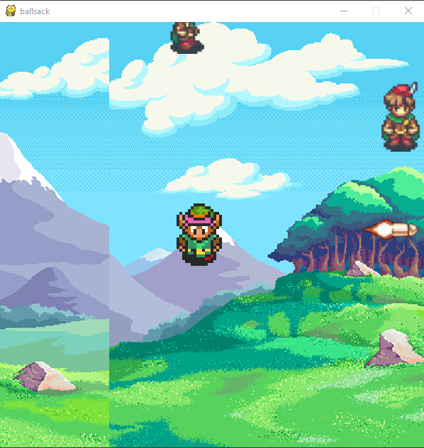
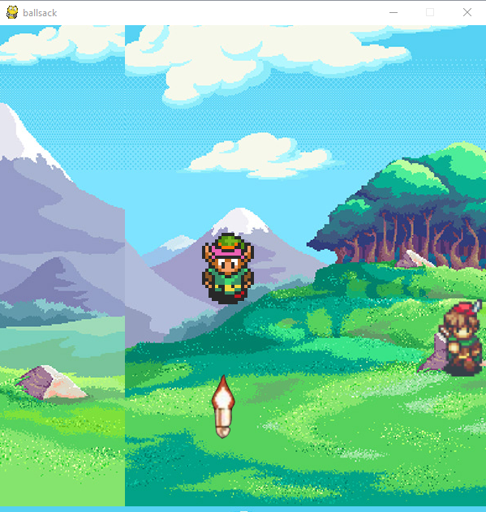
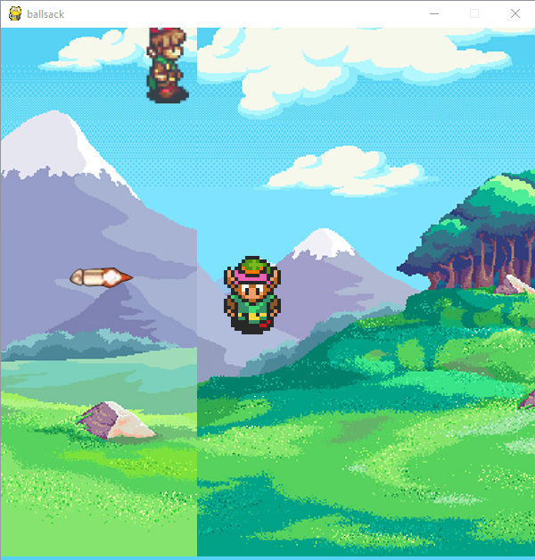
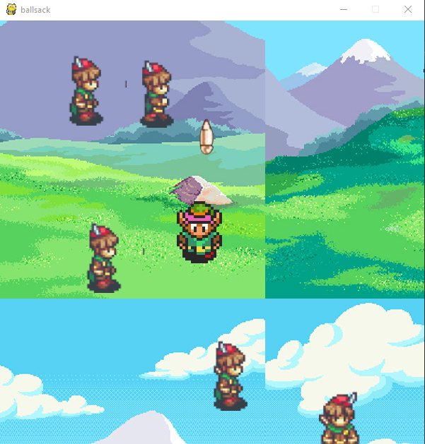

# Movable sprite with Edge Detection with more animations,shooting,and enemies(Project 1.04)
Travis Bales

## Description:
Using command line parameters set the screen size, title, color of the background, and size of sprite used in window.
The sprite is allowed to move around within the map boundaries and upon hitting the edge, a map boundary will appear and a message will appear
When hitting the barrier an explosion sprite will activate, can shoot projectiles,plays sound on shooting and when hitting a mob, There is also mobs now! Many upgrades to
the entire system (Completely recoded everything)
 
- **Using python 3.8.3**

### Files

|   #   | File            | Description                                        |
| :---: | --------------- | -------------------------------------------------- |
|1| [game_pt4.py](https://github.com/travisbales2304/4443-2D-PyGame-Bales/blob/master/Assignments/P1.04/game_pt4.py) |The main driver that launches the gui to produces the game window|
|2|[pygame_functions_clean.py](https://github.com/travisbales2304/4443-2D-PyGame-Bales/blob/master/Assignments/P1.04/pygame_functions_clean.py)|Helper module provided by StevePaget |
|3|[Background Image](https://github.com/travisbales2304/4443-2D-PyGame-Bales/blob/master/Assignments/P1.04/Background.jpg)|Imagine used for the background|
|4|[Enemies](https://github.com/travisbales2304/4443-2D-PyGame-Bales/blob/master/Assignments/P1.04/BardoFull.png)|Sprite used for the enemies|
|5|[Bullet Sprite](https://github.com/travisbales2304/4443-2D-PyGame-Bales/blob/master/Assignments/P1.04/Bullet.png)|Sprite used for the bullet|
|6|[Player Sprite for wall](https://github.com/travisbales2304/4443-2D-PyGame-Bales/blob/master/Assignments/P1.04/LinkWall.png)|sprite that shows when player hits a wall|
|7|[Right and Left bounds](https://github.com/travisbales2304/4443-2D-PyGame-Bales/blob/master/Assignments/P1.04/RightLeftBarrier.png)|Visual barries that is used for left and right bounds of map|
|8|[Top and Bot Bounds](https://github.com/travisbales2304/4443-2D-PyGame-Bales/blob/master/Assignments/P1.04/TopBotBarrier.png)|visual Barriers that is used for the top and bottom of the map|
|9|[Rocket sound](https://github.com/travisbales2304/4443-2D-PyGame-Bales/blob/master/Assignments/P1.04/RockShot.wav)|Sound that plays when rocket is shot|
|10|[explosion sound](https://github.com/travisbales2304/4443-2D-PyGame-Bales/blob/master/Assignments/P1.04/Splosion.wav)|sound that plays when an enemy is hit with rocket|
|11|[Screeshot1](https://github.com/travisbales2304/4443-2D-PyGame-Bales/blob/master/Assignments/P1.04/shot1.png)|Shooting to the right |
|12|[Screenshot2](https://github.com/travisbales2304/4443-2D-PyGame-Bales/blob/master/Assignments/P1.04/shot2.png)|Shooting down|
|13|[Screenshot3](https://github.com/travisbales2304/4443-2D-PyGame-Bales/blob/master/Assignments/P1.04/shot3.png)|Shooting to the left|
|14|[Screenshot4](https://github.com/travisbales2304/4443-2D-PyGame-Bales/blob/master/Assignments/P1.04/shot4.png)|Shooting up|
 

# HOW TO TRIGGER DEATH SPRITE (New 7/29/20)
  - run into a wall and click of for the death message and the death sprite will start animating until you move away from the wall
 

#### How to Run:
  - Download game_pt4.py to desktop
  - Download all other files to main directory EXCEPT the background, the background must be places in a folder in the main directory called "Images"
  - change directory to that location. Ex. cd C:\Users\"your user"\Desktop
  - Download all asset files
  - type "game_pt4.py 500 500 packman links2.png 9"
  - My program expects five parameters to be placed on the command line when you run the program.
  - Parameters
    - game width - width of the game window
    - game height - height of the game window
    - title - title of the game window
    - Player Character - the spritesheet for the player character
    - Enemy count - amount of enemies on the map
 #### How To Play:
     - Controls:
       - ↑ on keyboard to move up
       - ↓ on keyboard to move down
       - ← on keyboard to move left
       - → on keyboard to move right
       - Space Bar - shoot projectile in direction you are moving
  
##### Notes:
  - Make sure you import
    - pygame
    - random
    - json
    - pprint
    - sys
    - os
    - math
    - time
    - helper_module.py
    
   #### Output Images:
   |#|#|
   |:--:|---|
   |||
   |||
 

